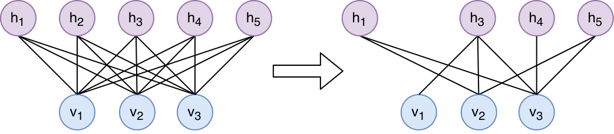

# Pruning Boltzmann Machines
This repository implements pruning mechanisms for generic RBM and DBM models. The base repository was extended with a pruning functionality which results in the removal of weights and units. Specifically, we use a local estimate of Fisher Information (FI) [1] to identify irrelevant parameters, remove them, and thereby model neurodevelopmental pruning [2].

## What's implemented

### Restricted Boltzmann Machines (RBM)

* k-step Contrastive Divergence;
* whether to sample or use probabilities for visible and hidden units;
* variable learning rate, momentum and number of Gibbs steps per weight update;
* regularization: L2 weight decay, dropout, sparsity targets;
* different types of stochastic layers and RBMs: implement new type of stochastic units or create new RBM from existing types of units;
* predefined stochastic layers: Bernoulli, Multinomial, Gaussian;
* predefined RBMs: Bernoulli-Bernoulli,  Bernoulli-Multinomial, Gaussian-Bernoulli;
* initialize weights randomly, from np.ndarray-s or from another RBM;
* can be modified for greedy layer-wise pretraining of DBM (see notes or [3] for details);
* visualizations in Tensorboard.

### Deep Boltzmann Machines (DBM)
* EM-like learning algorithm based on PCD and mean-field variational inference [3];
* arbitrary number of layers of any types; 
* initialize from greedy layer-wise pretrained RBMs (no random initialization for now);
* whether to sample or use probabilities for visible and hidden units;
* variable learning rate, momentum and number of Gibbs steps per weight update; 
* regularization: L2 weight decay, maxnorm, sparsity targets;
* estimate partition function using Annealed Importance Sampling [3]; 
* estimate variational lower-bound (ELBO) using logẐ (currently only for 2-layer binary BM); 
* generate samples after training; initialize negative particles (visible and hidden in all layers) from data;
* DBM class can be used also for training RBM and its features: more powerful learning algorithm, estimating logẐ and ELBO, generating samples after training;

### Pruning functionalities
* computation of the Fisher Information Matrix (FIM), its eigenvectors and its diagonal to estimate parameter importance
* iterative pruning of low-magnitude or low-importance weights based on an element-wise multiplication of the weight matrices with Boolean masks
* pruning criteria:
    * locally estimated parameter-wise FI (diagonal of the FIM, variance and heuristic estimate)
    * parameter-wise FI (first eigenvector of the FIM; for RBMs only)
    * anti-FI (removal of most important weights according to FIM diagonal)
    * weight magnitude
    * random
* removal of disconnected hidden units
* receptive fields (symmetric filters of (k,k), stride (1,1), no zero-padding)

## Dependencies
* python ~= 3.6
* packages listed in requirements.txt

## How to install
    git clone https://github.com/carolinscholl/PruningBMs.git
    cd PruningBMs
    pip install -r requirements.txt

If you want to install tensorflow without GPU support, replace corresponding line in requirements.txt. If you have already tensorflow installed, comment that line.

## Download data
After cloning the repository, get CIFAR-10 and MNIST training data:

    cd PruningBMs/data
    ./fetch_cifar10.sh
    ./fetch_mnist.sh

## How to run
Navigate to experiment scripts:

    cd pruning
To run the experiments on RBMs trained on CIFAR with pruning criterion = locally estimated FI:

    python CIFAR_PruneRBM.py FI_DIAG

Check positional arguments for custom experiments with

    python CIFAR_PruneRBM.py -h

For experiments on MNIST, first run

    python MNIST_Baselines.py

Then run one of the pruning experiments, e.g. pruning based on weight magnitude (iteratively remove 10% of lowest absolute weights):

    python MNIST_PrundeDBM_W.py

Again, check positional arguments for custom experiments with the -h flag. <strong>Caution:</strong> the default number of pruning sessions is set to 10 for experiments with DBMs trained on MNIST. The whole experiment may run several days.

## References 

[1] G.E. Rule, M. Sorbaro and M.H. Hennig. Optimal Encoding in Stochastic Latent-Variable Models. In: Entropy, 2020. [see article](https://www.mdpi.com/1099-4300/22/7/714/htm)

[2] G.M. Innocenti and D.J. Price. Exuberance in the development of cortical networks. In: Nature Reviews Neuroscience, pages 955-965, 2005. [see article](https://www.nature.com/articles/nrn1790/)

[3] R. Salakhutdinov and G. Hinton. Deep boltzmann machines. In: Artificial Intelligence and Statistics, pages 448–455, 2009. [see pdf](http://proceedings.mlr.press/v5/salakhutdinov09a/salakhutdinov09a.pdf)